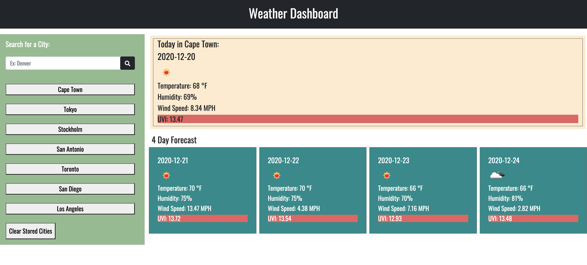

# WeatherDashboard
#### This is the repository for Homework 6, due December 19th, 2020.

### For this assignment, I have created an HTML file, a CSS file, and a JavaScript file. Using these, I have developed a weather application to display various meteorologic values for a 5 day forecast. Some features of this include:
    * Ability for the user to enter any city, and see a forecast.
    * This information includes temperature, an icon for the weather conditions, humidity, wind speed, and UV Index (with color indications).
    * When the user enters a city, it is saved to local storage for future reference.
    * The user can also clear this list using the button below the list.
    * It's the perfect way to "travel" in 2020!
    
### [Weather Dashboard](https://meganbryan.github.io/WeatherDashboard/)
### 
